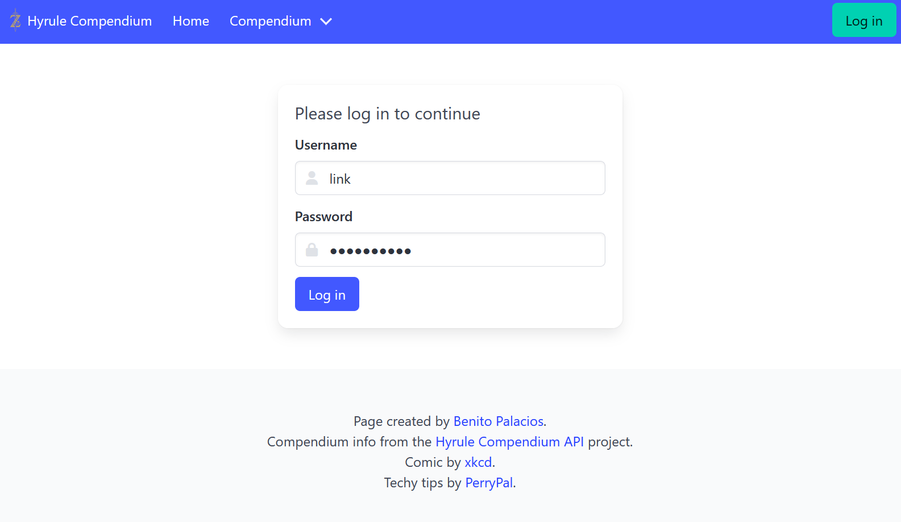
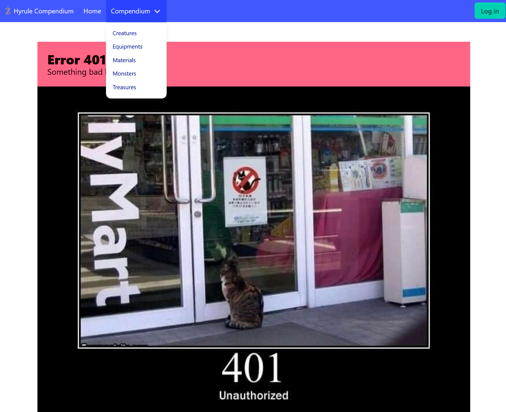
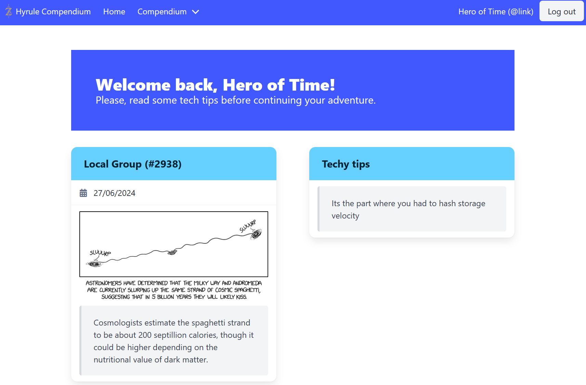
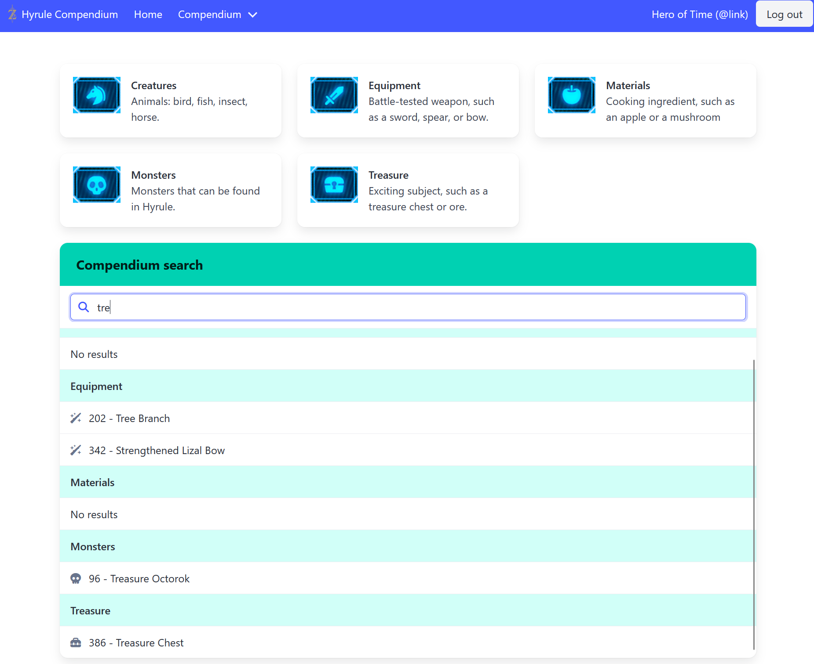
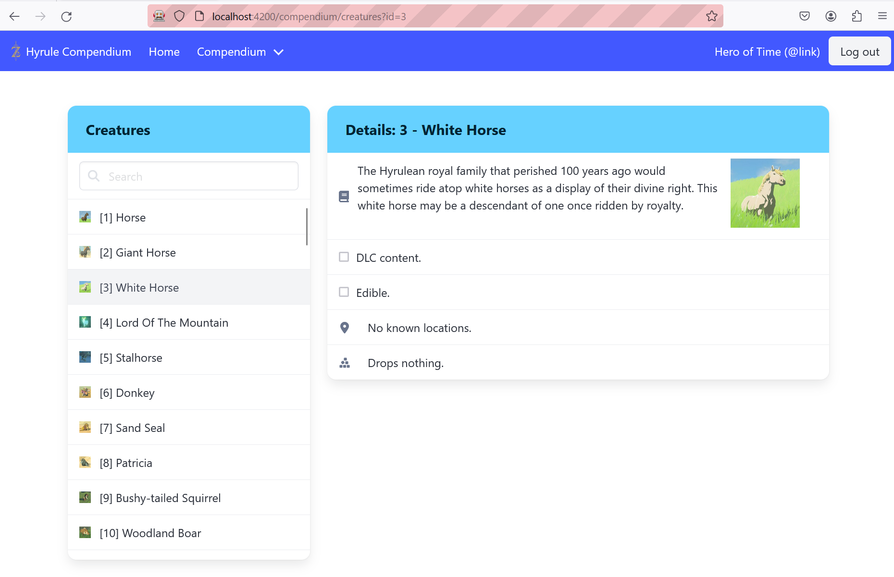
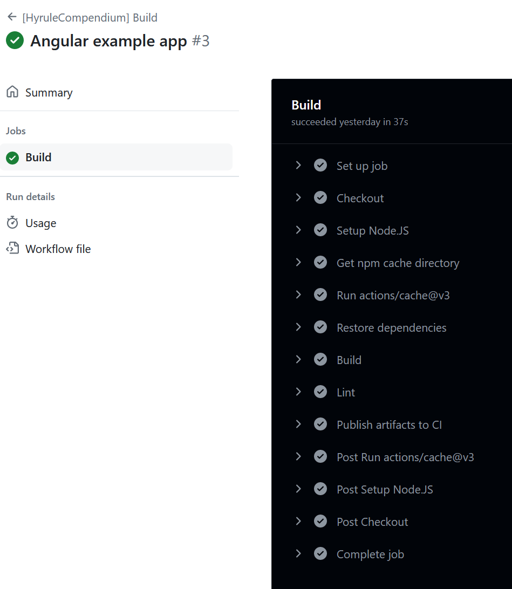

# HyruleCompendium

Example frontend-only application made with Angular. It displays the list of
items and monsters you can find in the game _The Legend of Zelda: Breath of the
Wild_.

## Stack

- Angular v18 with standalone components
- Node.JS v20
- [Bulma](https://bulma.io/) CSS framework
- Font Awesome 6 (via NPM)
- API integrations:
  - [Techy](https://techy-api.vercel.app/)
  - [xkcd](https://xkcd.com/json.html)
  - [HyruleCompendium](https://gadhagod.github.io/Hyrule-Compendium-API)

## Features

### Authorization

**Features used**:

- Route guards
- Browser local storage
- Route redirection
- Route optional parameters
- Angular reactive forms
- Component service communication + Observables
- Dependency injection

The frontend implements a basic and **fake** authorization logic. It supports
one user with the user and password hard-coded in the frontend code for demo
purpose. It does not contact any backend or auth service.

- User: `link`
- Password: `21/02/1986` (release date of the first The Legend of Zelda game)

There are guards for the routes that prevents accessing the resources if the
user is not logged. For demo purpose there are two implementations of the login
guard ([`auth.guard.ts`](./src/app/auth/auth.guard.ts)):

- **Redirection guard**: if the user is not logged, there is a silent
  redirection to the login page (`/login`).
  - Applies to the home route (`/` and `/home`).
- **Denied guard**: if the user is not logged, there is a silent redirection to
  a 401 Unauthorized error page (`/error/401`).
  - Applies to the `/compendium` route and its children.
- The routes `/login`, `/error` and not found are not protected.

If the login is successful the user details are stored in the browser local
storage, so it is not needed to re-login each time.

The class [`auth.service.ts`](./src/app/auth/auth.service.ts) implements the
logic to authenticate the user and keeps the information of the login when it
succeeds. Other components can access the service (via dependency injection) to
get the details of the user. For instance the menu component displays the user
name (_Hero of Time_) and displays a _Login_ or _Logout_ button depending on the
auth status. The status is propagated to other components via observables.

One additional feature of the _redirection guard_ is that it redirects to the
login page passing an option parameter: `redirectUrl` with the original URL. The
login component will redirect to this URL when the authentication succeeds. As a
basic security check, it prevents from redirection to other webpages by checking
if the redirection URL starts with `http`. In that case it will display the
error [`418` _I am a teapot_](https://http.cat/418).

The login component was implemented with the new Angular reactive forms.

## Home page

**Features used**:

- Router outlet + Router link
- Event binding
- Http client
- Webpack dev proxy (to avoid CORS issues)

## Compendium categories

**Features used**:

## Compendium entries

**Features used**:

## Continuous integration

**Features used**:

- Continuous integration
- Angular CLI
- NPM cache

The project implements a
[continuous integration pipeline](../.github/workflows/hyrule-build.yml) with
GitHub Actions. It restores the dependencies with NPM then it builds the project
with the production configuration and runs a linter. If these steps succeed, it
will provide the bundle as a build artifact.

The dependencies are cached to have faster builds using the built-in `cache`
task of GitHub Actions.

The pipeline run for pull request, tags `v*` and the `main` branch. It can also
be started manually.
